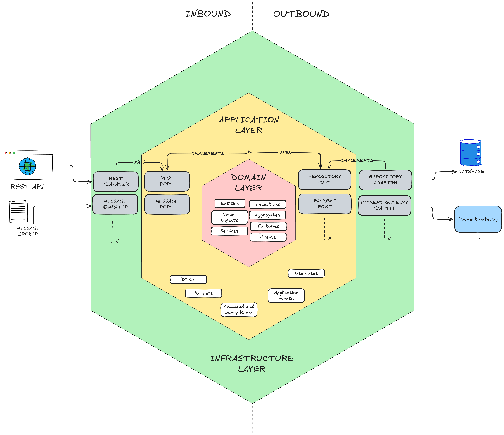

# Eco Transport System - Hexagonal Architecture

## Overview

The **Eco Transport System** is a Spring Boot project that demonstrates the implementation of **Hexagonal Architecture** (also known as Ports and Adapters Architecture). The goal of this project is to serve as a cheatsheet and reference for developers looking to design robust, decoupled, and maintainable Spring Boot applications using Hexagonal Architecture principles.

This architecture ensures a clear separation between business logic, application layers, and infrastructure details, making the system easier to maintain, test, and extend.



## Key Concepts

### Hexagonal Architecture Layers

1. **Domain Layer** (Core Logic):
    - Represents the heart of the system and contains the **business logic**.
    - Includes:
        - **Entities**: Represent core business models.
        - **Value Objects**: Immutable objects that represent concepts in the domain.
        - **Aggregates**: Group entities and encapsulate business rules.
        - **Services**: Contain domain-level logic.
        - **Factories**: Encapsulate object creation logic.
        - **Events**: Enable decoupled communication within the system.

2. **Application Layer** (Use Cases):
    - Coordinates tasks and workflows in the application.
    - Provides entry points for incoming requests via **ports**.
    - Includes:
        - **Use Cases**: Encapsulate application-specific logic.
        - **Command and Query Beans**: Process incoming requests.
        - **Application Events**: Triggered to facilitate communication between components.

3. **Infrastructure Layer**:
    - Handles the implementation of infrastructure-related concerns (e.g., persistence, messaging).
    - Includes **adapters** for external systems such as:
        - Databases
        - REST APIs
        - Message Brokers
        - Payment Gateways

### Ports and Adapters

- **Ports**:
    - Abstract interfaces in the application layer.
    - Define the behavior required by the core logic (e.g., `PaymentPort`, `RepositoryPort`).
- **Adapters**:
    - Implementations of the ports.
    - Act as a bridge between the application and external systems (e.g., `PaymentGatewayAdapter`, `RepositoryAdapter`).

### Inbound vs Outbound

- **Inbound**:
    - Handles incoming requests from external clients (e.g., REST APIs, Message Brokers).
    - Examples: `RestAdapter`, `MessageAdapter`.
- **Outbound**:
    - Facilitates communication with external services or databases.
    - Examples: `RepositoryAdapter`, `PaymentGatewayAdapter`.

---

## Features

- **Separation of Concerns**: Business logic is isolated in the domain layer, independent of infrastructure.
- **Testability**: Ports allow easy mocking and testing of core logic without dependency on infrastructure.
- **Extensibility**: New adapters can be added without modifying the core application logic.
- **Decoupled Design**: Each layer is loosely coupled, ensuring better maintainability.

---

## Directory Structure

```plaintext
src/main/java/com/example/ecotransport/
├── domain
│   ├── entities/
│   ├── services/
│   ├── events/
│   ├── factories/
│   ├── exceptions/
│   └── valueobjects/
├── application
│   ├── usecases/
│   ├── ports/
│   │   ├── inbound/
│   │   └── outbound/
│   └── mappers/
├── infrastructure
│   ├── adapters/
│   │   ├── rest/
│   │   ├── repository/
│   │   ├── messagebroker/
│   │   └── paymentgateway/
│   └── configuration/
└── main
```

---

## Contributing

Contributions are welcome! Please submit a pull request or open an issue to suggest improvements or report bugs.

---

## License

This project is licensed under the [MIT License](./LICENSE).

---